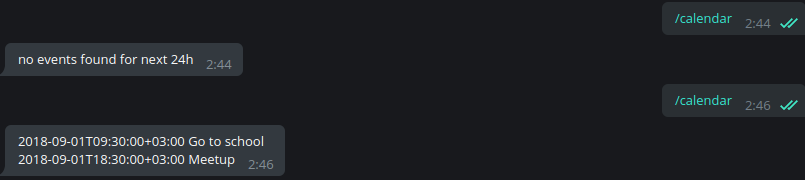

# teledarbot
Getting events from google calendar by telegram bot in python3

### Installation
1. [Generate credentials.json](https://docs.simplecalendar.io/google-api-key/) and put near get_events.py 
(after first login token.json will be generated).
2. [Create telegram bot](https://docs.microsoft.com/en-us/azure/bot-service/bot-service-channel-connect-telegram?view=azure-bot-service-3.0) 
and put your <b>TOKEN</b> in bot.py
3. Run locally or [Push to heroku](https://devcenter.heroku.com/articles/git) or 

To run: `python3 bot.py`

Or: `heroku run python3 bot.py`

ps. I am NOT suggesting to put your credentials to heroku.

##### Example:

